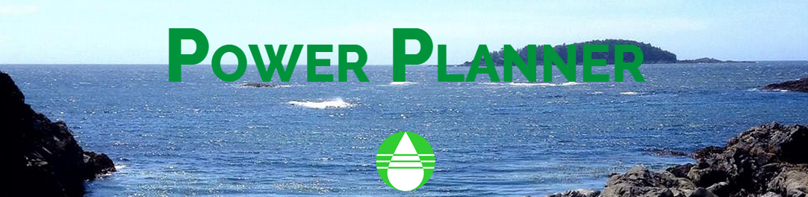
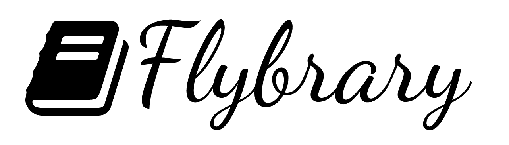
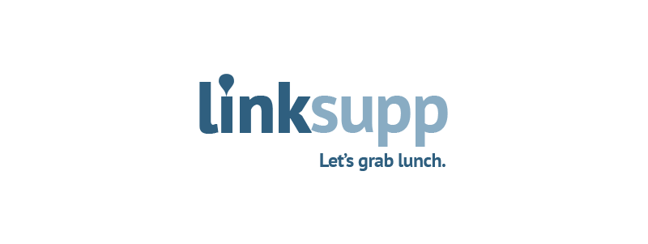

# Teams and Projects

### SignTalker
  
([view on GitHub](https://github.com/TaniaFerman/StartUp-Programming)) 

**Website:** Under construction  
**Description:** We are proposing a mobile app that will act as a tool to enable those in the deaf community to have a more dynamic communications with non-deaf people.

**Members**:

- Amanda Dash [[memet666@gmail.com](mailto:memet666@gmail.com)]
- Nora Huang [[norahuangsun@gmail.com](mailto:norahuangsun@gmail.com)]
- Dany Cabrera [[dcabrera@uvic.ca](mailto:dcabrera@uvic.ca)]
- Tristan Partridge [[tristanp2@hotmail.com](mailto:tristanp2@hotmail.com)]
- Maria Ferman [[tania_ferman@hotmail.com](mailto:tania_ferman@hotmail.com)]

**Presentations**:

- Idea proposal [slides](https://speakerdeck.com/startupprogramming/signtalker-idea-proposal)

---

### Boomerang ([view on GitHub]())  
**Website:**  
**Description:**  
**Members**:

- Charlotte Fedderly [[charlottefedderly@gmail.com](mailto:charlottefedderly@gmail.com)]
- Conner Leverett [[connerleverett@gmail.com](mailto:connerleverett@gmail.com)]
- Daniel Templeman [[daniel.templeman@gmail.com](mailto:daniel.templeman@gmail.com)]
- Mavis Brace [[mavislauren@gmail.com](mailto:mavislauren@gmail.com)]
- Tyler Potter [[tylerjamespotter@gmail.com](mailto:tylerjamespotter@gmail.com)]
- Brady Schnell [[bradyschnell@gmail.com](mailto:bradyschnell@gmail.com)]

**Presentations**:

- Idea proposal [slides](https://speakerdeck.com/startupprogramming/boomerang-idea-proposal)

---

### SmirkSpace ([view on GitHub]())  
**Website:**  
**Description:**  
**Members**:

- Dahv Reinhart [[dahvreinhart@gmail.com](mailto:dahvreinhart@gmail.com)]
- Kolby Chapman [[kol_j@hotmail.com](mailto:kol_j@hotmail.com)]
- Madeline Petersen [[madpeter@uvic.ca](mailto:madpeter@uvic.ca)]
- Omnielle Halton [[om.halton@gmail.com](mailto:om.halton@gmail.com)]
- Tim Baker [[tbakerx@gmail.com](mailto:tbakerx@gmail.com)]
- Bridget Rassell [[bridget.rassell@gmail.com](mailto:bridget.rassell@gmail.com)]

**Presentations**:

- Idea proposal [slides](https://speakerdeck.com/startupprogramming/smirkspace-idea-proposal)

---

### Daytomate ([view on GitHub](https://github.com/fridayideas))  
  
**Website:** [https://fridayideas.github.io/](https://fridayideas.github.io/)  
**Description:** DayTomato is a mobile application designed for locals. DayTomato provides the opportunity for locals to share their opinion on businesses, activities, restaurants, anything! Automate your day with the trip builder, provided to you by locals.  
**Members**:

- Ryan Samarajeewa [[ryan.samarajeewa@gmail.com](mailto:ryan.samarajeewa@gmail.com)]
- Nick Addison [[Nick.b.addison@gmail.com](mailto:Nick.b.addison@gmail.com)]
- James Woo [[jamesjaywoo@gmail.com](mailto:jamesjaywoo@gmail.com)]
- Brian Chen [[brianchen.czq@gmail.com](mailto:brianchen.czq@gmail.com)]
- Zane Li [[zanelib1@gmail.com](mailto:zanelib1@gmail.com)]
- Alix Voorthuyzen [[alix4000@shaw.ca](mailto:alix4000@shaw.ca)]

**Presentations**:
- Idea proposal [slides](https://speakerdeck.com/startupprogramming/daytomate-idea-proposal)

---

### ClubHub ([view on GitHub](https://github.com/Wubbadub/ClubHub/))  
**Website:**  
**Description:** Platform allowing university clubs to create a club page and students to easily find info about any club.  
**Members**:

- Kelsey Legault [[kelsey.legault@gmail.com](mailto:kelsey.legault@gmail.com)]
- Brendon Earl [[bearl@uvic.ca](mailto:bearl@uvic.ca)]
- Andrew Stocks [[agstocks@uvic.ca](mailto:agstocks@uvic.ca)]
- Juan Carlos Gallegos [[jcgallegdup@gmail.com](mailto:jcgallegdup@gmail.com)]
- Josh Pearson [[joshdpearson@gmail.com](mailto:joshdpearson@gmail.com)]
- Ben Hawker [[bhawker@uvic.ca](mailto:bhawker@uvic.ca)]

**Presentations**:

- Idea proposal [slides](https://speakerdeck.com/startupprogramming/clubhub-idea-proposal)

---

# Alumni

## 2014

### [beLocal](https://github.com/beLocalVictoria)  
  
**Website:** [belocalvictoria.me](https://belocalvictoria.me)  
**Description:** A web application that connects Local Vendors with the community by allowing them to post information about their business, what items they produce, and where they will be selling.  
**Members**:

- Scott Low [[scouter32@gmail.com](mailto:scouter32@gmail.com)]
- Samuel Navarrete [[cakebrewery@gmail.com](mailto:cakebrewery@gmail.com)]
- Riz Panjwani [[panjwani.riz@gmail.com](mailto:panjwani.riz@gmail.com)]
- Carly Lebeuf [[carly.lebeuf@gmail.com](mailto:carly.lebeuf@gmail.com)]
- Jyoti Sheoran [[sheoranjs24@gmail.com](mailto:sheoranjs24@gmail.com)]

---

### [Power Planner](https://github.com/prashantchhabra89/Alternate-Power-Source-Property-Mapper)  
  
**Website:** [power-planner.appspot.com](http://power-planner.appspot.com/)  
**Description:** Putting power in people's hands for finding sites for sustainable electricity generation.  
**Members**:

- Charlie Guan [[sirius890928@gmail.com](mailto:sirius890928@gmail.com)]
- Jonathan Lam [[lamjwe@uvic.ca](mailto:lamjwe@uvic.ca)]
- Daniel Faulkner [[danielafaulkner@gmail.com](mailto:danielafaulkner@gmail.com)]
- Chuan Yun Loe [[cyloe3@gmail.com](mailto:cyloe3@gmail.com)]
- Prashant Chhabra [[prashant.chhabra89@gmail.com](mailto:prashant.chhabra89@gmail.com)]

---

### [Flybrary](https://github.com/Brkk/textchanger)  
  
**Website:** [flybrary.ca](http://flybrary.ca/)  
**Description:** The peoples network for sharing textbooks, connecting you with community members that have the books you need.  
**Members**:

- Jordan Lerner [[jordan.m.lerner@gmail.com](mailto:jordan.m.lerner@gmail.com)]
- Logan Masniuk [[logan.masniuk@gmail.com](mailto:logan.masniuk@gmail.com)]
- Berk Yazicioglu [[yaziciogluberk@gmail.com](mailto:yaziciogluberk@gmail.com)]
- Paulo Tabarro [[bobleujr@hotmail.com](mailto:bobleujr@hotmail.com)]
- James Hedin [[jhedin10@gmail.com](mailto:jhedin10@gmail.com)]

---

### [linksupp](https://github.com/nfeliciano/mangiamo)  
  
**Website:** [www.linksupp.com](http://www.linksupp.com/)  
**Description:** A web application that is aimed for business savvy, outgoing groups of people who are looking for opportunities to meet new contacts, expand their friend base by meeting people informally for a meal.  
**Members**:

- Christopher Cook [[cjcook@uvic.ca](mailto:cjcook@uvic.ca)]
- Hardeep Kevin Gill [[hkevgill@uvic.ca](mailto:hkevgill@uvic.ca)]
- Jesper Rage [[jrage@uvic.ca](mailto:jrage@uvic.ca)]
- Lloyd Montgomery [[lloydrmontgomery@gmail.com](mailto:lloydrmontgomery@gmail.com)]
- Noel Feliciano [[felicianonoel@gmail.com](mailto:felicianonoel@gmail.com)]