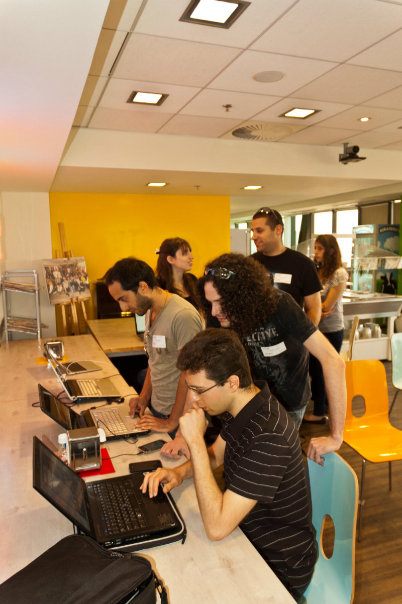

# Testimonials

### Student questionnaire (2010/2011 and 2011/2012 - Tel Aviv University)
>"Difficult but interesting, and requires a lot of effort"  

>"The best preparation for the real world, that applies everything we learned"  

>"An opportunity to learn a lot of new technologies and areas, unlike anything else I've done at the university"  

>"Probably the single most significant thing I've done during my degree ..."  

>"The workshop is challenging and requires a looot of time and effort, but is worth the end result, and the knowledge acquired in the process"

